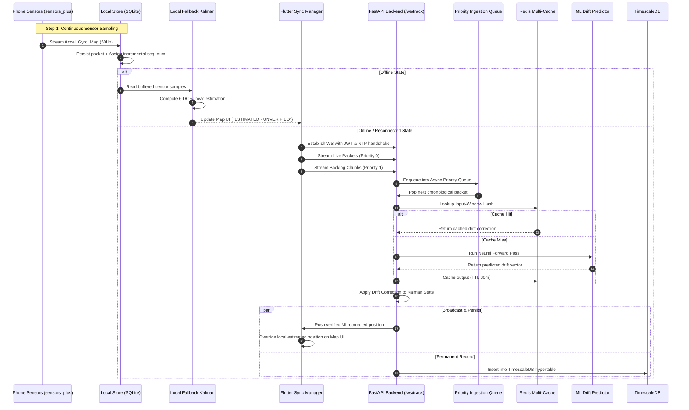

# AI-ML Based Intelligent Dead Reckoning System
**Complete Architecture Specification — Flutter/Dart Frontend & Python/FastAPI Backend**  
*Offline-Resilient, Non-Blocking, Cache-Accelerated & Cryptographically Secured*

---

## 1. Executive Summary & Core Concept

Dead reckoning estimates an entity's current position by projecting from a known starting point using motion sensors (accelerometer, gyroscope, and magnetometer) rather than relying on continuous GNSS/GPS reception. In GPS-denied environments (underground tunnels, multi-level basements, dense urban canyons, and mines), dead reckoning is the primary method for continuous positioning.

### The Double-Integration Drift Problem
Integrating raw IMU accelerometer data twice ($a \to v \to p$) and gyroscope data once ($\omega \to \theta$) leads to compounding errors:
- Gyroscope bias errors cause angular errors that scale linearly $O(t)$.
- Accelerometer bias coupled with angular error causes position errors that accumulate quadratically $O(t^2)$ and cubically $O(t^3)$.

```
   Raw Sensors (Accel / Gyro / Mag)
                 │
                 ▼
  Stage 1: Statistical Fusion (Kalman Filter)
  ── Removes white noise, predicts state, fuses 9-DOF kinematics ──
                 │
                 ▼
  Stage 2: Learned Non-Linear Drift Correction (Deep Learning / ML Bridge)
  ── Compensates for non-linear biases, pedestrian gait mechanics, vibration ──
                 │
                 ▼
       True Corrected Trajectory
```

This system solves this challenge with a **two-tier architecture**:
1. **Edge Client (Flutter/Dart):** Continuous sensor sampling, persistent local buffer, lightweight uncorrected on-device Kalman filter for zero-latency offline map updates, resilient WebSocket streaming with jittered backoff.
2. **Backend Engine (Python/FastAPI):** Asynchronous chunked ingestion, priority queues, 9-DOF Kalman filter (`filterpy`), neural network drift compensator (BiLSTM/GRU/TCN), Redis multi-tier caching (input-window hashing), and TimescaleDB long-term storage.

---

## 2. End-to-End System Architecture

```
+──────────────────────────────────────────────────────────────────────────────+
|                           FLUTTER CLIENT (Dart)                              |
|                                                                              |
|  +────────────────────────────────────────────────────────────────────────+  |
|  |                Sensor Acquisition Layer (sensors_plus)                 |  |
|  |  • 3-Axis Accel (m/s²)  • 3-Axis Gyro (rad/s)  • Magnetometer (µT)     |  |
|  +──────────────────────────────────┬─────────────────────────────────────+  |
|                                     │                                        |
|                                     ▼                                        |
|  +────────────────────────────────────────────────────────────────────────+  |
|  |                 Persistent Local Store (SQLite / Hive)                 |  |
|  |  • Write-ahead local buffer (every packet saved BEFORE network transmit)|  |
|  |  • Incremental sequence generator (seq_num: 1, 2, 3...)                |  |
|  |  • Last known verified position cache                                  |  |
|  +───────────────┬──────────────────────────────────┬─────────────────────+  |
|                  │                                  │                        |
|        [When Offline]                       [When Online]                    |
|                  ▼                                  ▼                        |
|  +───────────────────────────────+   +────────────────────────────────────+  |
|  | On-Device Fallback Kalman     |   | Sync & Reconnection Manager        |  |
|  | • Lightweight linear filter   |   | • JWT Handshake Authentication     |  |
|  | • Zero ML drift correction    |   | • NTP Clock Drift Calibrator       |  |
|  | • Keeps local map updating    |   | • Backoff + Jitter WS Client       |  |
|  | • UI marked: "[ESTIMATED]"    |   | • Outgoing packet chunking         |  |
|  +───────────────┬───────────────+   +──────────────────┬─────────────────+  |
|                  │                                      │                    |
|                  ▼                                      ▼                    |
|       +──────────────────────+                WebSocket / WSS (Primary)      |
|       | Live Map UI Viewport |                REST /sensor-data (Fallback)   |
|       +──────────────────────+                          │                    |
+───────────────────▲─────────────────────────────────────┼────────────────────+
                    │                                     │
                    │ Corrected Position Push             │ Ingestion Stream
                    │                                     ▼
+───────────────────┴──────────────────────────────────────────────────────────+
|                        PYTHON BACKEND (FastAPI)                              |
|                                                                              |
|  +────────────────────────────────────────────────────────────────────────+  |
|  | Connection & Ingestion Gateway                                         |  |
|  | • WebSocket Endpoint: /ws/track/{device_id}?token=<jwt>                |  |
|  | • Auth Validator: Decodes & verifies HMAC-SHA256 JWT                   |  |
|  | • Ingestion Dispatcher: Sorts packets by (device_id, seq_num)          |  |
|  +──────────────────────────────────┬─────────────────────────────────────+  |
|                                     │                                        |
|                                     ▼                                        |
|  +────────────────────────────────────────────────────────────────────────+  |
|  | Priority Asynchronous Queue System (asyncio.Queue / Worker Pool)       |  |
|  | • High Priority: Real-time live frames (low latency)                   |  |
|  | • Normal Priority: Backlog chunks (50-100 items per slice)             |  |
|  | • Guaranteed cooperative multitasking: Live users NEVER starved       |  |
|  +──────────────────────────────────┬─────────────────────────────────────+  |
|                                     │                                        |
|                                     ▼                                        |
|  +────────────────────────────────────────────────────────────────────────+  |
|  | Multi-Tier Caching & Deduplication Layer (Redis 7+)                    |  |
|  | • Window Hash Cache: SHA-256(sensor_window) -> Cached ML inference     |  |
|  | • Device Live Cache: Current state & calibration constants (TTL 1 hr)  |  |
|  | • TTL Expiry Handler: Falls back to TimescaleDB on cache miss          |  |
|  +──────────────────────────────────┬─────────────────────────────────────+  |
|                                     │                                        |
|                                     ▼                                        |
|  +────────────────────────────────────────────────────────────────────────+  |
|  | Dual-Stage Sensor Processing Pipeline                                  |  |
|  | 1. Kalman Filter (filterpy): 9-DOF sensor fusion -> Rough Position     |  |
|  | 2. ML Bridge: Cache hit? -> Return cached drift offset                |  |
|  |                Cache miss? -> Run BiLSTM/GRU model -> Update Redis     |  |
|  | 3. Final State Computation: Rough Position - ML Drift Vector           |  |
|  +──────────────────────────────────┬─────────────────────────────────────+  |
|                                     │                                        |
|                  ┌──────────────────┴──────────────────┐                     |
|                  ▼                                     ▼                     |
|  +───────────────────────────────+   +────────────────────────────────────+  |
|  | WebSocket Broadcast Engine    |   | Persistent Storage Layer           |  |
|  | • Emits verified coordinates  |   | • PostgreSQL 16 + TimescaleDB      |  |
|  | • Flags backlog reconciliation|   | • Hypertables for raw IMU & tracks |  |
|  | • Overrides client estimate   |   | • Permanent historical audit trail |  |
|  +───────────────────────────────+   +────────────────────────────────────+  |
+──────────────────────────────────────────────────────────────────────────────+
```

---

## 3. Deep-Dive: Architectural Solutions to Core Challenges

### 1) Offline Map Freezing & On-Device Fallback Kalman Filter
* **Problem:** When network connectivity drops, standard cloud-centric applications freeze position updates, causing disorientation or complete UI failure.
* **Solution:** 
  - A lightweight 6-DOF / 9-DOF Linear Kalman Filter runs directly on the Flutter client inside Dart.
  - **Deliberate Scoping:** The on-device filter intentionally **excludes ML drift correction** to conserve battery life, prevent thermal throttling, and avoid complex multi-threaded background isolates.
  - **User Experience:** The UI remains interactive and fluid. During disconnection, the trajectory is styled with a dashed line and badged with an **`[ESTIMATED - UNVERIFIED]`** HUD tag.
  - **Reconciliation:** When the connection resumes and backend computations finish, the authoritative ML-corrected coordinates seamlessly replace the local approximations.

### 2) Handling Large Backlogs Without Server Lag (Starvation Prevention)
* **Problem:** When devices reconnect after long dropouts (e.g., 20 minutes in a basement), dumping thousands of buffered samples can saturate backend event loops, causing lag or downtime for real-time users.
* **Solution:**
  - **Cooperative Chunking:** The client transmits backlogs in finite chunks (e.g., batches of 50 to 100 points).
  - **FastAPI Asynchronous Priority Queue:**
    ```python
    # backend/queue_manager.py
    import asyncio
    from dataclasses import dataclass, field
    from typing import Any

    @dataclass(order=True)
    class PacketItem:
        priority: int  # 0: Real-time Live, 1: Backlog Batch
        seq_num: int
        data: Any = field(compare=False)

    class IngestionQueue:
        def __init__(self):
            self.queue = asyncio.PriorityQueue()

        async def push_live(self, packet):
            await self.queue.put(PacketItem(priority=0, seq_num=packet["seq"], data=packet))

        async def push_backlog_chunk(self, chunk):
            for packet in chunk:
                await self.queue.put(PacketItem(priority=1, seq_num=packet["seq"], data=packet))
                # Yield control back to the event loop every 20 packets
                await asyncio.sleep(0)
    ```
  - Real-time packets (`priority=0`) are immediately dispatched ahead of backlog records (`priority=1`), ensuring live users experience sub-50ms latency regardless of backlog volume.

### 3 & 8) Packet Sequence Ordering & Clock Drift Synchronization
* **Problem:** Mobile device system clocks are notorious for skew, timezone anomalies, and manual resets, which causes timestamp-based ordering to fail.
* **Solution:**
  1. **Session Sequence Numbering:** Every packet includes a monotonic integer `seq_num` ($1, 2, 3, \dots, N$) reset only on a new session ID. The backend reordering buffer sorts on `(session_id, seq_num)` before processing.
  2. **Free NTP Synchronization on Handshake:** Upon establishing a WebSocket connection, the Flutter app performs a 3-way time sync with the backend to establish the offset $\Delta t$:
     $$\Delta t = \frac{(T_{\text{recv}} - T_{\text{send}}) - (T_{\text{server\_reply}} - T_{\text{server\_recv}})}{2}$$
     All recorded timestamps are adjusted by $\Delta t$ without modifying the phone's system time.

### 4 & 7) Preventing Redundant AI Computation via Input-Window Hashing
* **Problem:** Backlog data chunks often contain overlapping sliding sensor windows (e.g., 2-second windows with 50% overlap). Running continuous deep learning forward passes (LSTM/GRU) on previously seen or overlapping frames wastes server GPU/CPU cycles.
* **Solution:**
  - Compute a deterministic hash of the quantized sensor input window before running inference:
    ```python
    import hashlib
    import numpy as np

    def compute_window_hash(device_id: str, imu_window: np.ndarray) -> str:
        # Quantize to 3 decimal places to eliminate float noise jitter
        quantized = np.round(imu_window, decimals=3).tobytes()
        digest = hashlib.sha256(quantized).hexdigest()[:16]
        return f"ml_cache:{device_id}:{digest}"

    async def get_drift_correction(device_id: str, window: np.ndarray, redis_client):
        cache_key = compute_window_hash(device_id, window)
        cached_result = await redis_client.get(cache_key)
        if cached_result:
            return parse_cached_drift(cached_result) # O(1) Cache Hit!
        
        # Cache Miss: Execute Model Forward Pass
        correction = ml_model.predict(window)
        await redis_client.setex(cache_key, timedelta(minutes=30), serialize(correction))
        return correction
    ```

### 5) Managing Reconnection Spikes (Thundering Herd Mitigation)
* **Problem:** When cell service returns after an outage, hundreds of devices reconnect simultaneously, crashing the backend.
* **Solution:** The Flutter WebSocket client uses **Full Jitter Exponential Backoff**:
  $$T_{\text{sleep}} = \text{Uniform}(0, \min(T_{\text{max}}, T_{\text{base}} \times 2^{\text{attempt}}))$$
  - Base backoff: $1.0\text{s}$
  - Max backoff: $32.0\text{s}$
  - Random jitter prevents synchronized reconnection waves.

```dart
// flutter/lib/services/websocket_service.dart
import 'dart:math';
import 'dart:async';

class ResilientWebSocket {
  int _attempt = 0;
  final Random _random = Random();
  final double baseDelay = 1.0;
  final double maxDelay = 32.0;

  Duration _calculateNextDelay() {
    final exponential = baseDelay * pow(2, _attempt);
    final capped = min(maxDelay, exponential);
    final jitter = _random.nextDouble() * capped;
    _attempt++;
    return Duration(milliseconds: (jitter * 1000).toInt());
  }

  void resetBackoff() {
    _attempt = 0;
  }
}
```

### 6) Recovering Expired Cache Data (Multi-Tier Storage Hierarchy)
* **Problem:** Redis caches device state with an expiry TTL (e.g., 1 hour). If a device stays offline longer than the TTL, the cache key expires, resulting in lost calibration constants and baseline positions.
* **Solution:** Two-tier hierarchical state recovery:
  ```
  Check Redis (Live Cache)
          │
     [Cache Hit] ──> Return state instantly (<1ms)
          │
    [Cache Miss]
          ▼
  Query TimescaleDB Hypertable
  SELECT x, y, z, orientation, covariance_matrix
  FROM device_trajectories
  WHERE device_id = :id
  ORDER BY time DESC LIMIT 1;
          │
          ▼
  Repopulate Redis Cache & Resume Fusion Pipeline
  ```

### 7) Securing Data Streams (Zero-Cost JWT Authentication)
* **Problem:** Open WebSockets allow rogue devices to inject fake sensor data, spoof locations, or perform DoS attacks.
* **Solution:** Require a signed JSON Web Token (JWT) on the initial WebSocket handshake via query parameters or headers.
  - Verification occurs before upgrading the HTTP connection to WebSocket protocol.
  - The JWT payload verifies `device_id`, session expiry, and team credentials.

```python
# backend/auth.py
from fastapi import WebSocket, status, HTTPException
import jwt

SECRET_KEY = "sih_backend_secret_key"
ALGORITHM = "HS256"

async def authenticate_ws(websocket: WebSocket) -> str:
    token = websocket.query_params.get("token")
    if not token:
        await websocket.close(code=status.WS_1008_POLICY_VIOLATION)
        return None
    try:
        payload = jwt.decode(token, SECRET_KEY, algorithms=[ALGORITHM])
        return payload.get("device_id")
    except jwt.PyJWTError:
        await websocket.close(code=status.WS_1008_POLICY_VIOLATION)
        return None
```

---

## 4. Step-by-Step Data Flow



---

## 5. Offline & Failure Handling Matrix

| Scenario | Risk | System Mitigation & Resolution Strategy |
| :--- | :--- | :--- |
| **WiFi / Mobile Data Dropout** | UI freezes, user gets lost | Local SQLite buffers all readings. On-device lightweight Kalman filter generates real-time estimated steps; UI displays `[ESTIMATED]` status badge. |
| **Backend Temporary Downtime** | Lost sensor measurements | Flutter client catches WebSocket disconnects, buffers data to disk, and initiates exponential backoff + jitter retries until service returns. |
| **App Killed by OS while Offline** | In-memory queue wiped | Readings are written to SQLite on disk **prior** to memory dispatch. On launch, the buffer resumes without data loss. |
| **Out-of-Order Backlog Delivery** | Corrupted trajectory path | Packets carry strict incremental `seq_num` and NTP-synchronized timestamps. Ingestion reorder buffer reconstructs chronological sequence. |
| **Massive Backlog Ingestion** | Server memory/CPU starvation | Backlogs are received in 50-100 sample chunks and scheduled at `Priority 1` in `asyncio.PriorityQueue`, guaranteeing live users (`Priority 0`) instant processing. |
| **Reconnection Spike (Herd Effect)**| Server network stack crash | Capped exponential backoff with full randomized jitter ($1\text{s} \to 32\text{s}$) spaces reconnection requests evenly over time. |
| **Redis Cache Expiration (>1 hr)** | Lost state on device reconnect | System detects Redis cache miss and queries TimescaleDB for the latest verified state and covariance matrix. |
| **Mobile Clock Drift & Skew** | Inaccurate velocity integration | Monotonic session sequence counters govern packet ordering; NTP handshake syncs the client-server offset $\Delta t$. |
| **Unauthorized Data Injection** | Spoofed tracks, DoS | JSON Web Token (JWT) validation required during the initial WebSocket handshake before socket upgrade. |

---

## 6. Multi-Layer Caching Architecture

| Cache Tier | Physical Location | Key Structure | Stored Data & Purpose | Invalidation / Eviction Policy |
| :--- | :--- | :--- | :--- | :--- |
| **Live Device Cache** | Redis (RAM) | `device:state:{device_id}` | Most recent coordinates, velocity, orientation, and Kalman covariance matrix. | TTL = 1 Hour (Auto-purges inactive sessions). |
| **ML Inference Cache** | Redis (RAM) | `ml_cache:{device_id}:{sha256}` | Predicted drift vectors keyed by quantized IMU window hashes to avoid duplicate ML runs. | TTL = 30 Minutes. |
| **Sensor Calibration Cache**| Redis (RAM) | `calib:{device_id}` | Bias calibration offsets and scaling factors for phone accelerometer/gyroscope. | TTL = 24 Hours. |
| **Historical Source of Truth** | PostgreSQL / TimescaleDB | `device_trajectories` | Complete historical trajectory points, reconstructed backlogs, and metrics. | Permanent storage; retention policies via TimescaleDB chunks. |
| **On-Device UI Cache** | SQLite / Hive (Flutter) | `offline_buffer_table` | Buffered un-transmitted IMU packets and last verified backend position. | Cleared after confirmed server ingestion ACK. |

---

## 7. Technology Stack Summary

```
========================================================================================
Layer                 Technology / Package            Function
========================================================================================
Mobile Frontend       Flutter 3.x / Dart              Cross-platform client application
Sensors API           sensors_plus (pub.dev)          Continuous 50-100Hz Accel/Gyro/Mag sampling
Local Storage         sqflite / hive (pub.dev)        Crash-safe, disk-persisted offline buffer
Connectivity Detection connectivity_plus (pub.dev)   Automatic network state transitions
On-Device Fusion      Custom Dart Kalman Filter       Lightweight linear fallback (offline mode)
Real-time Transport   web_socket_channel (pub.dev)    Full-duplex streaming with backoff & jitter
Backend Framework     Python 3.11+ / FastAPI          High-concurrency asynchronous API server
Queue & Concurrency   asyncio.PriorityQueue           Starvation-free priority backlog scheduler
Server Sensor Fusion  filterpy / NumPy                Full 9-DOF Extended Kalman Filter (EKF)
Neural Drift Engine   PyTorch / ONNX Runtime          Deep learning gait & drift compensation
High-Speed Cache      Redis 7+                        Sub-millisecond caching & window deduplication
Time-Series Database  PostgreSQL 16 + TimescaleDB     Scalable hypertable trajectory storage
Security & Auth       PyJWT / python-jose             Cryptographic token handshake verification
========================================================================================
```

---

## 8. Implementation Roadmap & Next Steps

1. **Step 1: Database & Cache Setup**
   - Initialize PostgreSQL with TimescaleDB hypertable for `sensor_packets` and `device_positions`.
   - Configure Redis instance with memory limits and LRU eviction.
2. **Step 2: FastAPI Ingestion Core**
   - Implement `/ws/track/{device_id}` with JWT handshake verification.
   - Implement `IngestionQueue` with priority dispatch (live vs backlog).
   - Hook up `filterpy` Kalman Filter fused with Redis ML window hash lookup.
3. **Step 3: Flutter Client Offline Engine**
   - Build `sensors_plus` listener piping raw readings to local SQLite write-ahead table.
   - Implement the lightweight on-device Dart Kalman filter for offline map panning.
   - Build the auto-reconnecting WebSocket client with jittered exponential backoff.
4. **Step 4: End-to-End Testing & Drift Benchmarking**
   - Simulate 5-minute network dropouts in simulated GPS-denied environments.
   - Validate backlog reconciliation, chunked queue throughput, and cache hit ratios.
